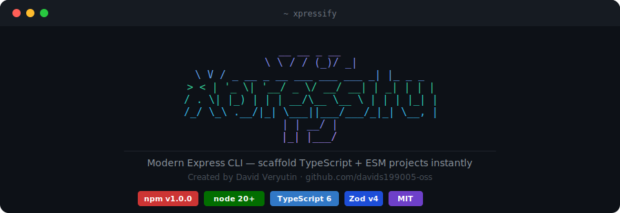

# Xpressify

<div align="center">




Built by [David Veryutin](https://github.com/davids199005-oss)

</div>

---

## Overview

Xpressify is a command-line tool that eliminates the boilerplate of starting a new Express + TypeScript project. Instead of spending 30 minutes configuring compilers, linters, and middleware, you run one command and get a production-ready project structure with everything already wired together.

It also grows with your project — the `generate` command lets you add routes, middleware, and TypeScript constructs directly from the terminal, following consistent conventions every time.

```bash
npm install -g xpressify
```

---

## Commands

### `x new <name>`

Scaffolds a new Express + TypeScript project with an interactive prompt-driven setup.

```bash
x new my-api
```


The CLI will ask you to choose a package manager (npm, pnpm, or yarn), which code quality tools to include, and which optional libraries you need. After confirming, it creates the project and installs all dependencies automatically.

**What gets generated:**

```
my-api/
├── src/
│   ├── app.ts          — Express app with cors, helmet, rate-limit
│   ├── server.ts       — Entry point with dotenv and PORT
│   ├── routes/
│   ├── controllers/
│   ├── services/
│   ├── middlewares/
│   └── utils/
├── .env.example
├── .gitignore
├── tsconfig.json
└── package.json
```

**Core dependencies — always included:**

| Package | Purpose |
|---|---|
| `express` | Web framework |
| `dotenv` | Environment variables |
| `cors` | Cross-origin resource sharing |
| `helmet` | Security headers |
| `express-rate-limit` | Rate limiting |
| `typescript` + `tsx` | TypeScript execution |
| `nodemon` | Auto-restart on file changes |

**Optional features — your choice:**

| Feature | What it does |
|---|---|
| ESLint | Flat config with TypeScript-aware rules |
| Prettier | Consistent code formatting |
| Husky | Git hooks — auto-adds ESLint + Prettier |
| GitHub Actions | CI pipeline: typecheck → lint → test → build |
| Zod | Schema validation library |
| Logger | Pino (fast, JSON) or Winston (multi-transport) — generates config |
| JWT | Installs jsonwebtoken + bcryptjs with types |

---

### `x g <type> <n>`

Generates a typed component inside an existing project. Run from any subdirectory — Xpressify will find the project root automatically by walking up the directory tree until it finds a `package.json`.

```bash
x g route     users                   # router + controller + service
x g middleware auth                   # typed Express middleware
x g class     src/models/User         # TypeScript class
x g interface src/types/Product       # TypeScript interface
x g enum      src/enums/Status        # TypeScript enum
```

For `route`, three files are created following layered architecture — the router goes into `src/routes/`, the controller into `src/controllers/`, and the service into `src/services/`. Each file includes typed handler stubs and a hint on how to register the router.

For `class`, `interface`, and `enum`, the name argument can include a path prefix. Writing `x g class src/models/User` places the file at exactly that location relative to the project root — no need to `cd` into subdirectories first.

---

## Aliases

All three binary names are registered on global install:

```bash
x new my-api           # shortest
xpressify new my-api   # explicit
xpressify-cli new my-api
```

---

## Requirements

Node.js 20 or higher.

```bash
node --version   # should be ≥ v20.0.0
```

---

## License

MIT — see [LICENSE](./LICENSE)

---

<div align="center">
  <sub>Built with care by <a href="https://github.com/davids199005-oss">David Veryutin</a></sub>
</div>
